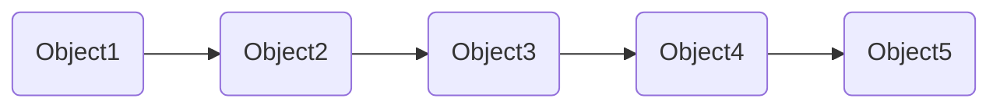

## 연결 리스트 용어
### Head

### Tail

### Node (노드)

### NextPointer or Next (다음 포인터)

### Previous Pointer or Prev (이전 포인터)

### Singly Linked List (단일 연결 리스트)

### Doubly Linked List (이중 연결 리스트)

### Circular Linked List (순환 연결 리스트)

## 단일 연결 리스트
